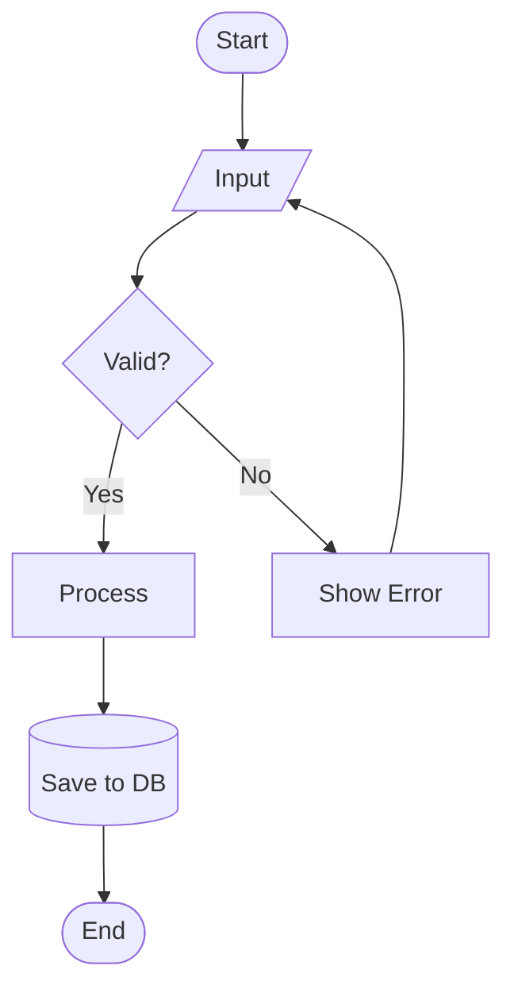
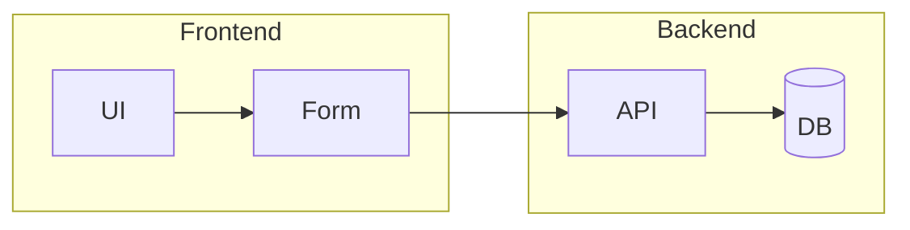
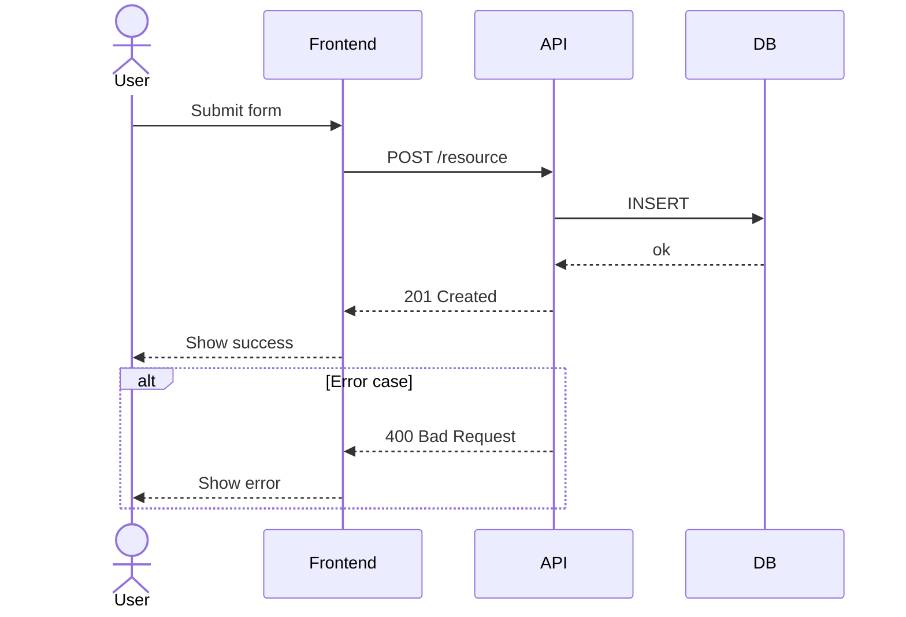
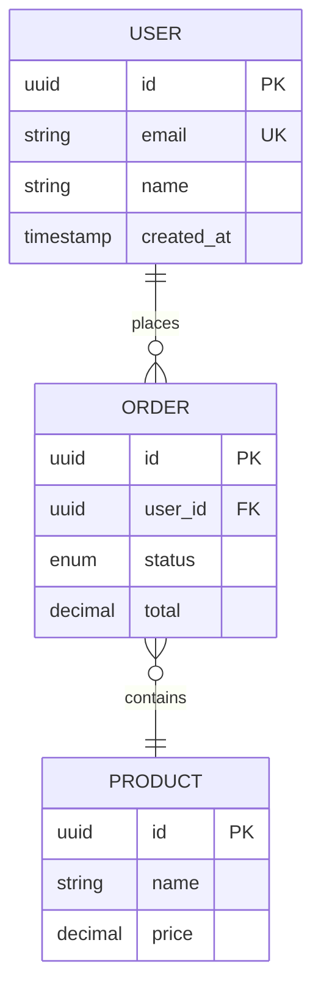
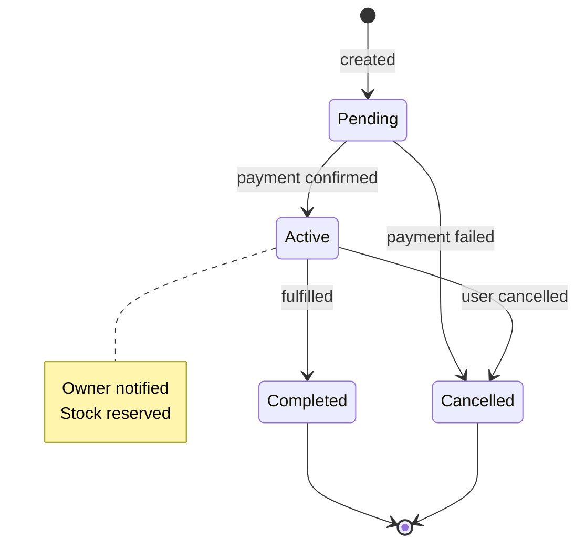
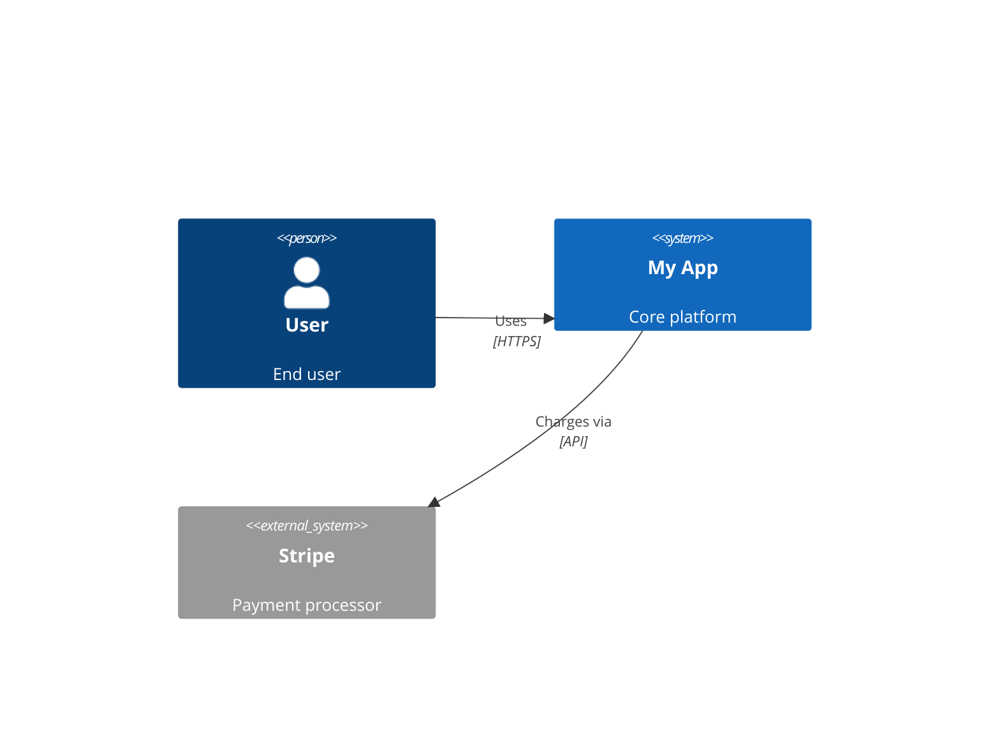
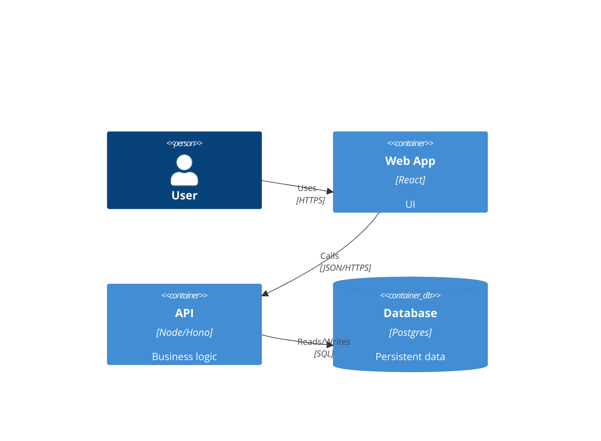
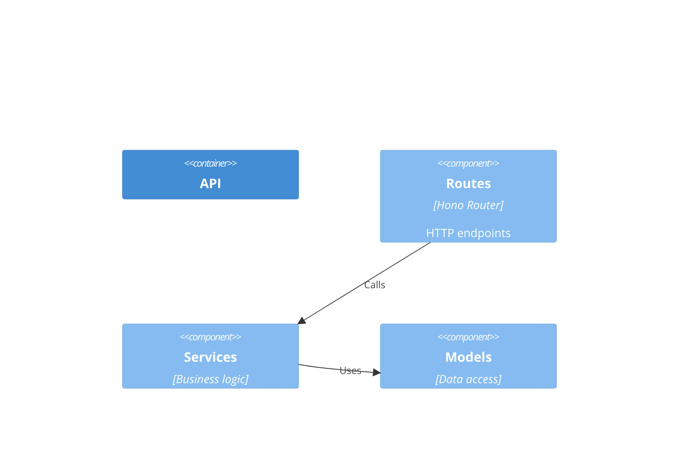
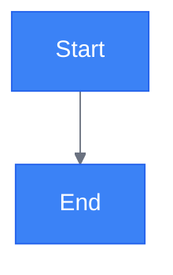
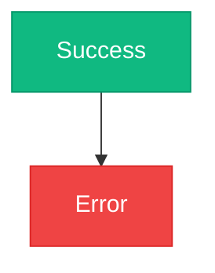

# Mermaid Quick Reference

For more details: https://mermaid.ai/open-source/intro

## Diagram Type Selection

| Content | Diagram Type |
|---------|-------------|
| Process with decisions | `flowchart` |
| API / service interactions | `sequenceDiagram` |
| Database / entity relationships | `erDiagram` |
| System architecture | `C4Context` / `C4Container` / `C4Component` |
| Object relationships | `classDiagram` |
| State machines / lifecycle | `stateDiagram-v2` |
| User experience flow | `journey` |

---

## Flowchart



**Node shapes:**

| Shape | Syntax | Use for |
|-------|--------|---------|
| Rectangle | `[Text]` | Process step |
| Rounded | `([Text])` | Start / End |
| Diamond | `{Text}` | Decision |
| Parallelogram | `[/Text/]` | Input / Output |
| Cylinder | `[(Text)]` | Database / Storage |
| Circle | `((Text))` | Connector |

**Direction:** `TD` (top→down) · `LR` (left→right) · `BT` · `RL`

**Subgraph grouping:**


---

## Sequence Diagram



**Participant types:** `actor` · `participant` · `boundary` · `control` · `entity` · `database` · `collections` · `queue`

**Arrow types:**

| Arrow | Syntax | Meaning |
|-------|--------|---------|
| Solid with arrowhead | `->>` | Message (most common) |
| Dotted with arrowhead | `-->>` | Return / response |
| Solid, no arrowhead | `->` | Message (no tip) |
| Dotted, no arrowhead | `-->` | Return (no tip) |
| Solid with cross | `-x` | Fire-and-forget |
| Dotted with cross | `--x` | Fire-and-forget response |
| Solid open arrow | `-)` | Async (open tip) |
| Dotted open arrow | `--)` | Async response (open tip) |

**Control blocks:** `alt / else / end` · `loop ... end` · `opt ... end` · `par ... and ... end`

---

## ERD



**Cardinality:**

| Symbol | Meaning |
|--------|---------|
| `\|\|` | Exactly one |
| `o\|` | Zero or one |
| `}o` | Zero or more |
| `}\|` | One or more |

Combine left + right sides: `USER \|\|--o{ ORDER` = one user to zero-or-more orders

---

## State Diagram



- `[*]` = initial / terminal state
- `note right of <State>` for annotations
- Use `state "Label" as Alias` for long names

---

## C4 Diagrams

**Context** — system in its environment:


**Container** — applications and data stores:


**Component** — internal structure of one container:


---

## Styling

**Custom theme:**


**Per-node class styling:**


---

## Key Rules

- Keep under **~20 nodes** — split into multiple diagrams if larger
- Use subgraphs to group related nodes in complex flowcharts
- Diagrams go inline in markdown as ```` ```mermaid ```` blocks — never as images
- Keep diagram source in version control alongside the code it describes
- Test rendering in the target platform (GitHub, Notion, VS Code, etc.)
